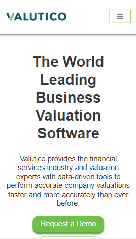
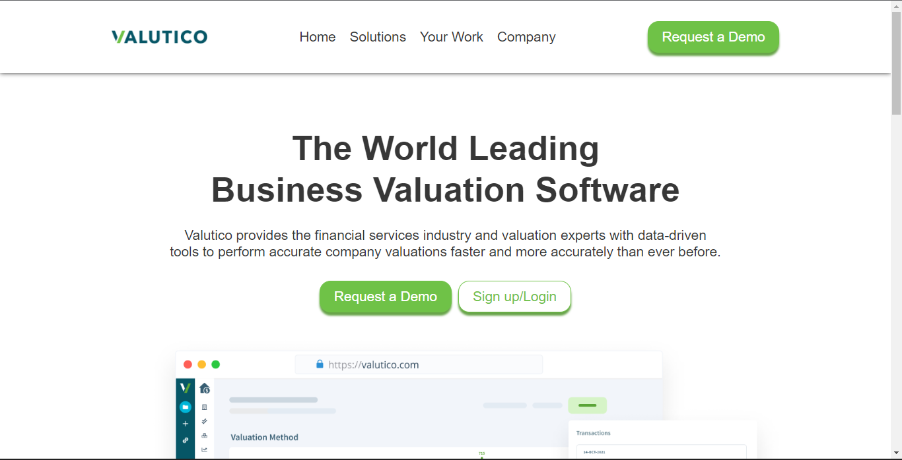

# Valutico - Genesys Project

This is a solution to the [Valutico Webpage Task on Genesys Upskill](https://bit.ly/dev-task-4). This task help you improve your coding skills and responsive design/layout.

## Table of Contents
- [Valutico - Genesys Project](#valutico---genesys-project)
  - [Table of Contents](#table-of-contents)
  - [Overview](#overview)
    - [The challenge](#the-challenge)
    - [Screenshots](#screenshots)
    - [Links](#links)
  - [My Process](#my-process)
    - [Built with](#built-with)
    - [What I learned](#what-i-learned)
    - [Continued development](#continued-development)
    - [Usefull resources](#usefull-resources)
  - [Author](#author)

## Overview
### The challenge

User should be able to:

- Use the knowledge on what have been taught in the program such as HTML, CSS, Flexbox, Media Query etc
- Make the webpage responsive
- Host the webpage with GitHub Pages or Netlify

### Screenshots
> Mobile View : 

<p align="center">  </p>

> Desktop View : 



### Links
- [Solution URL](https://github.com/ObiFaith/Landing_Page--Genesys)
- [Live Site URL](https://obifaith.github.io/Landing_Page--Genesys/)

## My Process

### Built with
- Semantic HTML5 markup
- CSS custom properties
- Flexbox
- Mobile-first workflow

### What I learned

- Text wrap property

```css
h2, p {
    text-wrap: balance;
}
```

- HTML Document Model Object for the Mobile Navigation

```javascript
const toggleMenu = document.querySelector('.toggle_menu');
const nav = document.querySelector('.nav');
toggleMenu.addEventListener('click', function (){
    nav.classList.toggle('d-block');
});
```

### Continued development
- HTML Document Model Object for Website Interactiveness

### Usefull resources
- [Conquering Responsive Layouts by Kevin Powell](https://courses.kevinpowell.co/conquering-responsive-layouts) - This helped me to understand Responsive layout. I really love the way the course was structured.

- [HTML DOM on freeCodeCamp](https://youtu.be/5fb2aPlgoys) -  This is an amazing video which helped me understand HTML DOM. I'd recommend it to anyone still learning this concept. Good content with Projects

## Author
- Twitter - [@faith_dev_](https://twitter.com/Faith_Dev_?t=nee2K5shnqNHtbiXPyMESQ&s=09)